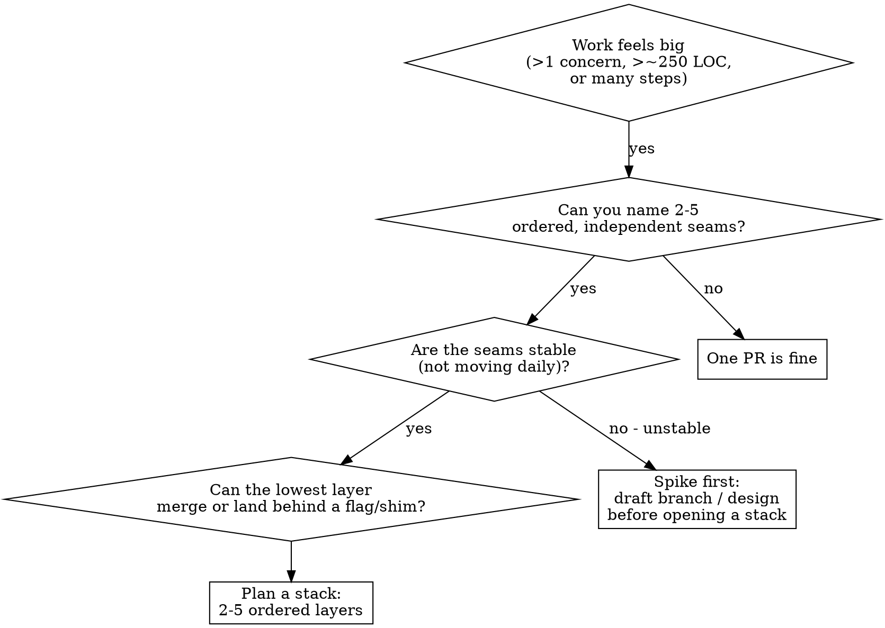
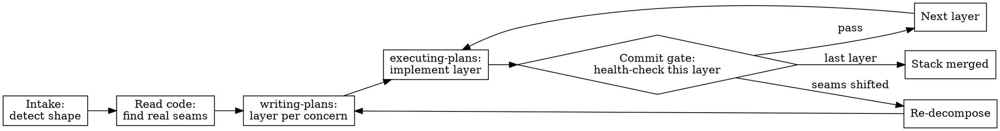

# Stacked PR Decomposition

## Overview

A **stacked PR** is an ordered chain of normal pull requests: the bottom PR targets trunk (`main`), and each higher PR targets the branch below it. GitHub now groups such chains into a first-class **Stack** — a stack map in the PR UI, rules/CI evaluated against the stack's ultimate target branch, and bottom-up direct or merge-queue merge. The CLI (`gh stack`) automates branch creation, cascading rebases, and submission.

This skill decides **whether** a piece of work is stack-shaped and, if so, **how to slice it into ordered, reviewable layers** and **delegate each layer** to an agent or author. The determining variable is the quality of the split, not the tool.

**Announce at start:** "I'm using the stacked-pr-decomposition skill to assess and plan layering."

## When to Use



**Use when ANY are true:**
- A ticket/prompt spans multiple concerns (backend + frontend, schema + behavior, refactor + feature) that could be reviewed by different audiences
- Early layers are strategically valuable even before the full feature ships (contract expansion, seam extraction, test scaffolding)
- The work forms a natural dependency chain: lower leaves (models, schema, ports) feed higher leaves (API routes, UI)
- A single PR would exceed ~250 changed LOC or ~25 files, or mix refactor + migration + behavior
- You are decomposing a spec/plan and want each slice to be independently mergeable
- A branch already contains the full work and you need to materialize it into reviewable stacked PRs without losing compile/test safety

**Do NOT use when:**
- The seams are unstable — invariants changing daily, adjacent layers rewriting each other
- The work is exploratory or tightly coupled with no clean cut lines (use a short-lived draft branch or design spike first)
- It's cross-fork OSS contribution — GitHub Stacks are same-repository only
- The team lacks reliable CI/bot infra at scale; a fragile stack amplifies noise, it doesn't fix it

## When in the Lifecycle

Decomposition is not one planning step — it tightens as you learn the code. Inject at three moments:

1. **Intake (after brainstorming, before recon)** — detect shape only. Output a flag: "stack candidate" or "single PR." Do NOT write layers blind; seams guessed before reading code churn.
2. **After codebase recon, before writing-plans** — real seams now visible (where the legacy caller lives, where a flag would go, which files are ports vs. behavior). Write the dependency story, pick the style, size layers. Feed the layer list into superpowers:writing-plans.
3. **At each layer's commit/PR gate (during executing-plans)** — re-run the Detection Signals + Red Flags. Did the layer bleed into the next? Is the bottom still green? Open the PR only if it passes.

The bottom layer is often the recon itself: refactor-first / migration-first stacks make the *first* mergeable PR the thing that exposes the real seam for the next layer. You don't plan the whole stack blind — you plan the boring bottom, ship it, and the next seam becomes visible.

**Retrospective split is first-class.** If implementation already exists, do not pretend you are still at intake. Work backwards from the diff: group files by concern, choose the boring bottom layer, then reconstruct intermediate commits/branches so every layer still compiles and remains merge-safe.



## Detection Signals

Score each proposed layer. From the research synthesis:

| Signal | Threshold (heuristic) | Why |
|---|---|---|
| Per-layer size | flag >400 review-relevant LOC; warn >250 LOC or >25 files | Review effectiveness drops as review size grows; generated/test-heavy LOC is cheaper but still affects navigation |
| Stack depth | review carefully >5; exceptional >7 | Deeper stacks = more navigation + dependency burden |
| Lower-layer first response | slow vs repo P75 | Latency compounds when every layer depends on the one below |
| Lower-layer check flakiness | red/green oscillation in last 3 runs | Unstable seams or noisy checks erode throughput |
| Rebase frequency after first review | >2 rebases on bottom | Trickiest part of stacking; repeated rebases = unstable foundation |
| Reviewer spread | every layer same reviewer set despite different concerns | Split along implementation order, not review value |
| Adjacent-layer file overlap | heavy overlap (unless deliberate migration) | Weakens atomicity; boundary may be arbitrary |

Count **review-relevant LOC**, not raw churn. Tests, snapshots, generated files, locale JSON, and lockfiles review differently from behavior code; they can still make navigation hard, but they should not force a bad seam by themselves.

A stack is healthy when lower layers are **boring** (low-surprise, high-reusability, low-review-ambiguity) and each layer passes the **dependency-story test**: you can explain why PR N must sit above PR N-1. If you cannot, the split is not good enough.

## Stack Styles

Pick the style whose bottom layer is the most boring. The best stacks make the bottom mergeable before the top exists.

### Refactor-first
Extract seam → rename/cleanup → add behavior on stable names/types. Early layers review easily and merge quickly; risk is renaming that erodes confidence.

### Migration-first (expand/contract)
Expand schema/contract → dual-write/migrate → cut over → cleanup. Lower-contract change lowers risk and eases rollback; needs disciplined compatibility windows.

### API-contract-first
Spec/interface stubs → consumers wire to contract → local behavior → cleanup. Pros: reviewers align on contract first. Cons: up-front design can slow purely local changes.

### Feature-flagged implementation
Flag plumbing → inactive path → incremental implementation → enable → remove flag. Lets small layers land safely on trunk; flags create operational debt if not cleaned up.

### Branch-by-abstraction
Introduce abstraction → route old calls through it → add new impl → switch → remove old. Avoids giant replacement branch drift; supports progressive cutover; needs careful abstraction design.

## Decomposition Workflow

1. **Map the dependency story.** Write one sentence per proposed layer saying what it depends on. Models/schema/ports at the bottom; behavior/UI at the top.
2. **Make the bottom boring.** Prefer refactor-first, contract expansion, ACL introduction, or test scaffolding as the lowest layer.
3. **Ensure ship-safety.** If a lower layer lands before higher behavior, hide incomplete user-visible behavior behind a flag or parallel-change shim. Unfinished behavior must never be exposed by a merged lower layer.
4. **Assign seats per layer.** Route reviewers by concern, not by ticket. Different concerns often deserve different reviewers.
5. **Keep the bottom green.** Lower layers must satisfy checks/reviews before higher layers can merge. If rebases cascade from the bottom, pause and restack — do not pile work on unstable foundations.
6. **Size each layer to one concern.** If a layer mixes refactor + migration + behavior, split again.

## Retrospective Split Workflow

Use this when one branch already contains the work and the task is "split this into a stack."

1. **Inventory the diff by concern, not by chronology.** Group files into contracts/models, shared utilities, data plumbing, UI/behavior, tests, and cleanup. The first grouping is allowed to move files between layers; the final stack is not a replay of your commit history.
2. **Place shared foundations low.** If two upper layers need the same graph utility, type, feature flag, or test helper, put it in the lowest layer that can merge safely. Do not duplicate or let adjacent layers rewrite it.
3. **Keep every intermediate branch compiling.** After slicing layer N, run the narrow check that proves N is valid without layers above it. A layer that only passes with unmerged higher code is not a layer.
4. **Handle shared files deliberately.** For `en.json`, package manifests, lockfiles, route maps, and generated registries, pick one: all related edits in the first layer that needs them; split by stable key namespace; or defer cosmetic/generated churn to cleanup. Never let every layer casually touch the same shared file.
5. **Co-locate tests with the behavior they prove.** Contract tests go with contract layers; UI tests with UI layers. If tests dominate LOC, mention that in the stack map instead of splitting a coherent behavior layer only to satisfy a raw line threshold.
6. **Write the stack map after slicing.** For each layer: purpose, base branch, files, dependency sentence, ship-safety statement, and verification command.

## Delegation

When subagents/parallel agents are available, each layer can be delegated once its dependency layer's contract is fixed:

- **Slice first, delegate per layer.** Treat the stack decomposition as the top-level plan (your job — do not outsource it). Then fan out one agent per layer only where layers are genuinely independent given the fixed contract.
- **Order gates, not parallel everywhere.** The bottom layer (schema/port/contract) is everyone's prerequisite — implement it inline or in a first wave. Only fan out layers that depend solely on already-fixed lower contracts.
- **Each agent gets:** its layer's files, the contract signature it consumes from the layer below, the contract signature it exposes to the layer above, and the constraint "do not change files outside your layer."
- **One cohesive story in branch names/titles:** `extract-auth-port` → `add-auth-contract` → `implement-oauth-flow` → `remove-legacy-auth`. The branch name is part of the review navigation model; expected order: foundation → integration → specialization.
- **CI choreography matches merge choreography.** Fast smoke tests on every layer; broader integration tests on the lowest mergeable layer; full-stack/staging checks on the top layer before a full stack merge.

A 2-4 layer stack with a fast CI loop and shared context usually improves review quality without much process overhead. Beyond 5 layers, navigation and dependency burden dominate.

## DDD Seams (when domain modeling is available)

When the domain tells you the cut lines, the stack feels clean to review:

- **Bounded context** = candidate for a single stack (usually too large for one PR).
- **Aggregate** = candidate for an individual layer (transactional boundary; external refs go through the aggregate root).
- **Anti-corruption layer** = good bottom layer when crossing contexts or extracting from legacy: introduce translator/facade first, route callers, add new model, remove legacy last.
- **Branch-by-abstraction** = replace one aggregate impl/repository/integration path: abstraction → migrate callers → new impl → cutover → cleanup.

If a change crosses many aggregates or contexts, assume the **stack boundary** is wrong unless it's a compatibility/migration layer.

## GitHub Stack Mechanics

Source: GitHub Docs — https://docs.github.com/en/pull-requests/how-tos/stacked-pull-requests

**Status and constraints:** Stacked PRs are in public preview. Every PR must be in the **same repository** and form a single linear chain; cross-fork stacks and branching stack shapes are not supported. GitHub Desktop does not support stacks. If a stack is fully merged, it is closed; adding branches later creates a new stack.

**Dependency rule:** if code in one layer depends on code in another, the dependency must be in the same branch or a lower branch. Put shared types, schemas, utilities, flags, and generated/shared-file ownership low enough that all higher layers can compile against them.

**Structure:** bottom PR base = stack trunk (`main`, default branch, release branch, etc.); each higher PR base = the branch below it. Each PR shows only the diff between its branch and the branch below it, so each layer needs a focused review story.

**Rules and CI:** every PR in the stack is evaluated against the stack base, not just its direct branch base. Required reviews, CODEOWNERS, required checks, and `pull_request` workflows targeting the base apply to every layer. GitHub exposes stack metadata at `github.event.pull_request.stack`; use it to skip expensive redundant jobs when appropriate.

**Merging:** merges happen bottom-up. Merging the top PR merges the whole stack; merging a mid-stack PR merges that PR and everything below it while upper PRs remain open and retarget. `gh stack merge` is all-or-nothing for the selected segment; merge queues enqueue the selected segment but may land PRs in separate groups as the queue processes them. Stacked merges cannot bypass merge requirements.

**Rebasing and sync:** rebasing is the fragile part. Use the GitHub UI server-side rebase or `gh stack rebase` for cascading rebases. `gh stack sync` fetches, reconciles remote/local stack state, fast-forwards trunk, cascades rebase if trunk moved, pushes with `--force-with-lease` when needed, syncs PR state, links open PRs into a stack, and optionally prunes merged local branches.

**CLI setup:** `gh stack` requires GitHub CLI and the extension:
```shell
gh extension install github/gh-stack
gh auth login
```
Quick path: `gh stack init` → commit bottom layer → `gh stack add <branch>` for each higher layer → `gh stack push` → `gh stack submit` → `gh stack view`. `gh stack add -Am "message"` can stage, commit, and add the next branch in one step.

**Useful commands:** `view` shows ordering/status; `up`/`down`/`top`/`bottom` navigate; `submit` pushes and creates/updates PRs; `link` turns existing branches/PRs into a stack without local tracking; `modify` is required to reorder/restructure a stack and needs a clean linear working tree; `unstack` dissolves stack tracking while preserving branches/PRs.

**Manual branches:** still fine when the team is not using `gh stack`: create branches bottom-up, set each PR base to the branch below it, and keep the stack map in PR descriptions. Use `gh stack` when you want CLI-assisted navigation, submit/link/sync automation, cascading rebases, or reordering via `modify`; it is convenience, not a correctness requirement.

**Programmatic tooling:** legacy pull-request merge endpoints cannot merge stacks; tools/bots need the Stacks API. Webhooks include stack data when PRs join/move/leave stacks; REST/GraphQL expose stack membership for dashboards and automation.

## Review Feedback + Rebase Loop

When review feedback lands on a mid-stack PR, fix it on the branch that owns the change — not on the top branch as a workaround.

1. Navigate to the owning branch: `gh stack checkout <branch>` or `gh stack up/down/top/bottom`.
2. Make the fix, stage, and commit it there.
3. Cascade the update through dependent layers: `gh stack rebase` (or `gh stack rebase --upstack` when starting from the changed branch).
4. Push the rebased stack: `gh stack push`. This uses `--force-with-lease` and retriggers CI on affected PRs.
5. Return to the working layer with `gh stack top` or `gh stack checkout <branch>`.

If the repo requires signed commits, avoid the GitHub website **Rebase stack** button; server-side rebases are unsigned. Use `gh stack rebase` locally, then `gh stack push`.

## Merge Gate + Troubleshooting

Before merging a PR or contiguous segment, verify: every PR below it is approved, checks pass, the stack is linear, and the current PR satisfies rules for the stack base. You cannot merge a mid-stack PR alone; PRs below it always merge with it.

## Merge Strategy

Do **not** flatten the stack into one giant PR after review. The point is separate review units with explicit dependencies.

Default for a feature that should land atomically: get every layer reviewed/approved, keep the stack green and linear, then use the GitHub UI merge box on the **top PR** (or `gh stack merge`) once. The merge box shows whole-stack status; GitHub lands the top plus every unmerged PR below it as one contiguous bottom-up operation.

Merge lower layers earlier when they are independently useful and merge-safe: foundation refactors, schema/contract expansion, inert flags, test scaffolding, or cleanup that does not expose unfinished behavior. Merging a mid-stack PR lands it plus everything below it; upper PRs remain open and retarget. After any bottom/partial merge, run `gh stack sync --prune` before continuing.

Use merge queue normally if the repo requires it; queued stacks stay ordered, but very large stacks may split across consecutive merge groups. If a lower PR is ejected, all PRs above it are ejected too.

Choose:
| Situation | Merge posture |
|---|---|
| User-visible feature must appear all at once | Approve all layers, merge top once |
| Lower layer improves code safely by itself | Merge that bottom/mid contiguous segment early |
| Lower layer exposes incomplete behavior | Keep it unmerged or hide behind a flag/shim |
| Review uncovers bad seam | Restack before merging; don't flatten as a shortcut |


| Symptom | Fix |
|---|---|
| Merge box shows **Rebase stack** | Stack is not linear; run `gh stack rebase && gh stack push` or use the website rebase if unsigned commits are acceptable |
| `gh stack rebase` conflicts | Resolve conflict markers, `git add`, then `gh stack rebase --continue`; use `--abort` to restore pre-rebase state |
| `gh stack sync` stops on conflict | It restores original branches; run `gh stack rebase`, resolve, then `gh stack push` |
| `gh stack modify` will not start | Need active stack, clean working tree, no rebase, no queued PR, linear history |
| Middle PR closed | Upper PRs are blocked; unstack/restructure with `gh stack modify`, then recreate/link |
| Merge queue ejects one PR | All PRs above it are ejected too; fix the cause and re-add the stack |
| Large stack in merge queue | Queue may exceed group max by 50%; larger stacks split across consecutive groups |

For local state after bottom merges, run `gh stack sync --prune`: fetch, fast-forward trunk, rebase remaining branches onto it, push, sync PR status, and delete merged local branches.

For CI cost, use stack metadata: lowest unmerged PR when `github.event.pull_request.stack.base.ref == github.event.pull_request.base.ref`; top PR when `github.event.pull_request.stack.position == github.event.pull_request.stack.size`.


## Checklists

### Author
- Define the dependency story before opening the stack. If you can't explain why PR N must sit above N-1, the split isn't good enough.
- One concern per layer; if it mixes refactor + migration + behavior, split again.
- Prefer boring lower layers: schema expansion, abstraction extraction, interface stabilization, ACL introduction, pure refactor.
- Submit as soon as a layer is ready; mark unfinished layers as draft. Do not wait for the whole feature.
- Route reviewers by layer, not by ticket.
- Keep the bottom green. Lower layers must pass checks/reviews before higher layers merge.
- If rebases keep cascading from the bottom, pause and restack.
- Hide incomplete user-visible behavior behind a flag or parallel-change path before landing lower layers.
- For retrospective splits, prove each branch compiles without layers above it; do not rely on the full original branch.
- Name shared files (`en.json`, package manifests, lockfiles, generated registries) in the stack map and explain which layer owns each one.
- Address review feedback on the branch that owns the change, then cascade with `gh stack rebase` / `gh stack push`.
- After bottom merges, run `gh stack sync --prune` before continuing work.

### Reviewer
- Read the stack map first: is this a foundation, mid-layer, or top?
- Judge the current layer against its stated purpose, not the full future feature.
- Ask whether the layer could merge safely today. If not, is a flag/shim/migration step missing?
- Look for overlap with adjacent layers — heavy overlap often means arbitrary boundaries.
- Be stricter on bottom layers about API shape, invariants, names — mistakes multiply upward.
- Approve good-enough lower layers that improve code health; prolonged blocking defeats throughput.
- Watch check quality, not just color — false positives and flaky mergeability checks are especially damaging in stacks.
- If the stack is deeper than the domain warrants, say so.
- Request changes on the layer that owns the problem. Do not ask the author to patch a lower-layer issue in a higher PR.
- Check whether requested changes force a cascade; if they do, expect upper-layer CI to rerun.

## Common Mistakes

| Mistake | Fix |
|---|---|
| Stacking to escape one giant PR | Stacking trades review size for dependency maintenance; only worth it with stable seams |
| Opening a stack before seams are stable | Spike/design first; stacking unstable work = churn amplifier |
| Mixing concerns in one layer | Split again; one concern per layer |
| Same reviewers on every layer despite different concerns | Route reviewers by layer concern |
| Bottom layer not green | Lower layers must pass before higher layers merge; keep bottom green |
| Letting rebases cascade without restacking | Pause, restack; don't pile on unstable foundations |
| Exposing incomplete behavior via a merged lower layer | Use a feature flag or parallel-change path |
| Treating stacking as ritual for exploratory work | Use a draft branch / design spike instead |
| Ignoring CI fan-out on every layer | Use stack metadata to gate heavy jobs (lowest unmerged / top only) |
| Treating a retrospective split like greenfield planning | Work backwards from the existing diff; every reconstructed layer must compile alone |
| Letting every layer touch the same shared file | Assign ownership: one layer, stable key namespace, or cleanup-only generated churn |
| Splitting only by raw LOC when tests dominate | Count review-relevant LOC; keep coherent behavior and explain test-heavy churn |
| Fixing review feedback on the top branch | Checkout the owning branch, commit there, rebase/push upward |
| Using website rebase in signed-commit repos | Rebase locally with `gh stack rebase`; server-side rebase commits are unsigned |
| Trying to merge a mid-stack PR by itself | Merge segments are contiguous from the lowest unmerged PR upward |
| Continuing after a bottom merge without syncing | Run `gh stack sync --prune` so remaining branches retarget cleanly |
| Flattening the stack into one PR after review | Keep layers as PRs; merge top once for atomic landing or merge safe lower segments early |

## Red Flags — Reconsider the Split

- You cannot articulate the dependency story (why N sits above N-1).
- The bottom layer is not merge-safe and not hidden behind a flag/shim.
- Every layer has the same reviewer set despite different concerns.
- Heavy adjacent-layer file overlap that is not a deliberate migration.
- Rebase cascades from the bottom after review has started.
- Each layer passes checks only in isolation — the "green stack illusion."
- Retrospective layers only compile when checked out with later branches.
- Shared files (`en.json`, lockfiles, package manifests, generated registries) are touched by many adjacent layers without an owner.
- Review feedback is patched in a higher layer than the code it changes.
- A stack needs unsigned server-side rebase in a signed-commit repo.
- A closed middle PR blocks upper PRs.

These mean: do not open the stack yet. Stabilize seams, or ship a single focused PR instead.